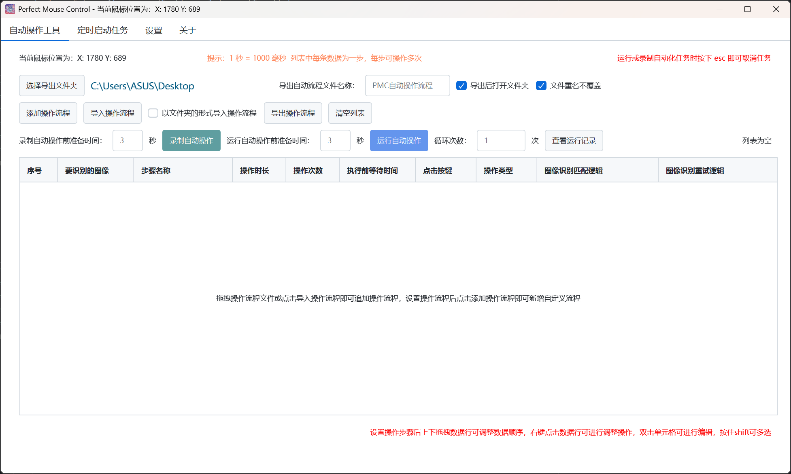

<h1>Perfect Mouse Control</h1>

基于 JavaFX 开发的开源跨平台自动操作工具，支持键鼠自动化、图像识别、流程录制与编辑。

    
    
    
    
    
    

----

## 项目简介

本项目是一个用 JavaFX 开发的自动操作工具。
可以编辑自动操作流程或录制自动操作流程，支持导入导出自动操作流程，支持循环自动操作。

本项目图像识别功能基于 JavaCV 实现的，可在自动操作流程中设置要识别的图片和终止操作图片。

自动流程文件为 .pmc 与 .pmcs 文件，本质为 json 文件，更改文件拓展名只为方便过滤可导入的文件。

.pmc 文件为包含操作流程步骤信息的文件，可直接解析并执行。

.pmcs 文件为多个 .pmc 文件的集合设置文件，用于批量执行 .pmc 文件，只记录了文件信息，不包含具体操作流程，需与 .pmc 文件配合使用。

本项目打包工具为 maven javafx:jlink 插件 + jpackage ，使用 jdk 版本为 Amazon Corretto 25 。

## 项目背景

开发这个项目主要目的是为了 ios 手游自动操作，由于 ios 没有模拟器，目前通过 macOS 的 iPhone 镜像连接手机，然后使用 macOS
的鼠标进行操作，也就可以通过自动操作工具来控制 iPhone 。
由于 macOS 上免费且容易使用的自动操作工具不是很多，所以就决定自己开发一个。

## 程序界面

## 如何打包

在 maven 依赖都下载完毕后需要对 jna-5.18.1.jar 、 jna-platform-5.18.1.jar
这几个不支持模块化的包进行模块化注入，具体方法可参考： https://blog.csdn.net/weixin_44167999/article/details/135753822

由于 jna-platform 依赖 Jna
，需要手动处理，具体方法较复杂，建议直接使用项目中提供的 [module-info.class](appBuilder/module-info.class) ，
将 [module-info.class](appBuilder/module-info.class) 使用任意支持向压缩包中添加文件的解压工具添加即可。

在注入模块化后即可使用 maven javafx:jlink 插件进行打包，打包后的程序文件在 [target/app](target/app)
中，其中启动文件为 [bin](target/app/bin)目录下的 app 脚本， win 系统为 [app.bat](appBuilder/win/app.bat) 脚本， macOS
为不带拓展名的可执行文件 [app](appBuilder/mac/app) 。
因为程序启动需要读取配置文件，需要将 [config](src/main/resources/priv/koishi/pmc/config)
文件夹和 [log4j2.xml](src/main/resources/log4j2.xml) 文件复制到程序启动文件 [target/app](target/app) 所在目录下。

因为自动操作工具需要监听全局键盘与鼠标事件，所以项目中引入了 jnativehook 来实现，打包需要将 jnativehook-2.2.2.jar 所在文件夹下的
JNativeHook.x86_64.dll（win系统） 复制到 ../app/bin/ 下并更名为 [JNativeHook.dll](appBuilder/win/JNativeHook.dll) ;
libJJNativeHook.x86_64.dylib （macOS） 复制到 ../Contents/MacOS/
下并更名为 [libJJNativeHook.dylib](appBuilder/mac/libJNativeHook.dylib) 。
图像识别功能使用 javacv 实现的，打包时 win 系统只需将相关 .dll 文件复制到 复制到 ../app/bin/ 即可， macOS 需将
libopenblas.0.dylib 复制到 ../Contents/MacOS/
下并更名为 [libopenblas_nolapack.0.dylib](appBuilder/mac/libopenblas_nolapack.0.dylib.zip) 。

在使用 jlink 打包后 win 系统直接双击 app.bat 即可运行， macOS 需要修改 app 文件在最后一行前加入 cd $DIR ，即使用 cd
命令打开程序所在目录才可使用脚本启动。 程序逻辑部分在 ../app/lib 目录中，后续更新只需替换 lib 文件夹即可。

在使用 jlink 打包后可使用 jpackage 命令将 jlink 打包产物转换为各操作系统下的常规可执行文件， win 系统为 .exe 文件， macOS
为 .app 文件。
需要将各操作系统对应的可执行文件对应的图标复制到 [target](target) 目录， win 系统为 [.ico](appBuilder/PMC.ico) 文件，
macOS 为 [.icns](appBuilder/PMC.icns) 文件。
之后在命令行进入 [target](target) 目录下执行对应操作系统的 jpackage 命令即可生成对应操作系统下的可执行文件。

jpackage 打包后 win 系统可直接使用 .exe 文件运行， macOS 需要将依赖的 .dylib 文件复制到 Perfect Mouse
Control.app/Contents/app/ 目录下。

打包需要的依赖库都已放在 appBuilder 目录中， win 系统为 .dll 文件， macOS 为 .dylib 文件。 win
系统只整理了 [x86_64](appBuilder/win) 版本的依赖库，
macOS [x86_64](appBuilder/mac) 版本全部整理完毕， [arm](appBuilder/mac_arm) 版本依赖库只整理了部分，因为没有相关机器无法验证缺失哪些依赖。
macOS 依赖文件中的 [libopenblas_nolapack.0.dylib](appBuilder/mac/libopenblas_nolapack.0.dylib.zip)
因文件太大所以进行了压缩，打包时需要在对应目录放入解压后的文件。

因为需要获取其他进程的窗口信息并进行移动，本项目使用 Jna 调用操作系统 api 获取相关信息， 在 win 系统下直接可以调用操作系统
api， 但在 macOS 下则需要使用更底层的语言去调用相关 api，本项目使用 Jna 调用 C 语言编写的 dylib 文件实现相关功能。

C 语言编写的 Native 代码在 [NativeCode](NativeCode) 这个目录下的 [MacWindowManager](NativeCode/MacWindowManager) 目录中，
其中 [MacWindowManager.xcodeproj](NativeCode/MacWindowManager/MacWindowManager.xcodeproj) 文件是 Xcode 项目文件，
[MacWindowManager.c](NativeCode/MacWindowManager/MacWindowManager.c)
和 [MacWindowManager.h](NativeCode/MacWindowManager/MacWindowManager.h) 文件是 C 语言编写的源码文件，需要使用 Xcode 编译为
.dylib 文件才可使用，编译后的文件为 [libMacWindowManager.dylib](appBuilder/mac/libMacWindowManager.dylib) 。

需要注意 macOS 可能只能在应用程序文件夹下运行，且需要开启辅助操作权限。如果开启辅助操作权限仍然无法启动程序，需要将 Perfect
Mouse Control.app 从辅助操作权限列表中移除后再重新添加并开启。
图像识别功能的权限检测使用 Jna 实现，不同版本的 macOS
可能鉴权方式不太一样，如果遇到开启权限仍然无法使用相关功能可将该部分代码去掉后自己实现，申请权限方式与辅助控制相似，只不过权限为录屏与系统录音权限。

如果打包后 macOS 的文件选择器 ui 为英文则需修改 Info.plist 将 CFBundleDevelopmentRegion 属性的值改为 zh_CN 。

jlink 打包后的操作都已写在 buildApp 脚本中，使用 jlink 打包后直接运行对应操作系统的 buildApp 脚本文件即可生成可执行文件。
程序的版本号相关信息将会由对应脚本从 [CommonFinals.java](src/main/java/priv/koishi/pmc/Finals/CommonFinals.java) 文件中的
version 属性读取，所以每次修改版本号信息时都需要修改该文件中的版本号。

jpackage 打包后如果需要修改 jvm 参数需要修改对应操作系统下的 .cfg 文件，项目中也有对应修改的代码，修改后下次启动程序即可生效。

win 的 .cfg 文件在 ../Perfect Mouse Control/app/bin/ 目录下，macOS 的 .cfg 文件在 ../Perfect Mouse
Control.app/Contents/app/ 目录下。
项目中的 [Perfect Mouse Control.cfg](Perfect%20Mouse%20Control.cfg) 文件仅供测试读取和修改功能，无法修改 idea 启动时的
jvm 参数。

修改参数只需要更改 java-options= 右侧的内容即可，如果需要添加参数则需在行末添加新的 java-options= 并在右侧写上需要的 jvm
参数，删除参数必须删除整行，只删除 java-options= 右侧的内容会导致程序无法启动，目前没有发现如何单行添加多个参数的写法。

# macOS 应用签名

在 macOS 中如果应用不签名则无法在其他电脑上安装，使用自签名需要手动去信任应用，否则无法运行。

应用签名则需要使用证书，所以需要在钥匙串中创建一个用来代码签名的证书，签名后才会弹出自动化权限申请的系统对话框，后续才能在
系统设置-意识与安全性-自动化 中找到这个应用的权限开关。

# 自动更新功能的实现

本项目使用 uniCloud 的云存储与云函数实现应用更新服务，同时使用阿里云与支付宝云的免费的存储空间实现应用下载服务，因为每月流量有限，每次更新会先使用阿里云进行尝试，支付宝云作为备用。

本项目实现了全量更新与增量更新两种更新方式，通过客户端传递版本号与操作系统简称，服务端 uniCloud
会返回对应的阿里云与支付宝云的更新文件下载地址以及版本信息，客户端根据返回内容来进行更新。

服务端更新脚本路径在 [index.js](appBuilder/PMCUpdate/index.js) 中，两个云空间使用同一个脚本。

客户端在下载更新时，阿里云可获取下载进度，支付宝云无法获取下载进度，所以只有用阿里云下载时进度条才会正常显示。

客户端下载更新结束后将会调用资源目录下的更新脚本进行自动更新，脚本目录在 [script](src/main/resources/priv/koishi/pmc/script)
中， Windows 会调用 [update.bat](src/main/resources/priv/koishi/pmc/script/update.bat) 脚本，
macOS 会调用 [update.sh](src/main/resources/priv/koishi/pmc/script/update.sh) 脚本。
脚本逻辑就是关闭正在运行的程序，然后替换掉要更新的文件，最后删除临时文件。两个脚本都需要管理员权限，且 macOS 需要输入计算机密码。

更新时下载的文件将会保存在操作系统的临时目录下的一个专有的隐藏临时文件夹中，无论是否更新成功都会删掉临时目录下创建的专有临时文件夹。

# 项目地址

GitHub：https://github.com/Asukkaa/PMC

Gitee：https://gitee.com/wowxqt/pmc

# 赞赏

如果喜欢本项目的话可以扫描微信赞赏码给作者一个赞赏

或前往爱发电为作者发电：https://afdian.com/a/project_pmc